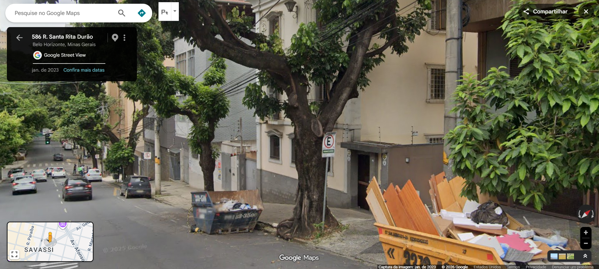
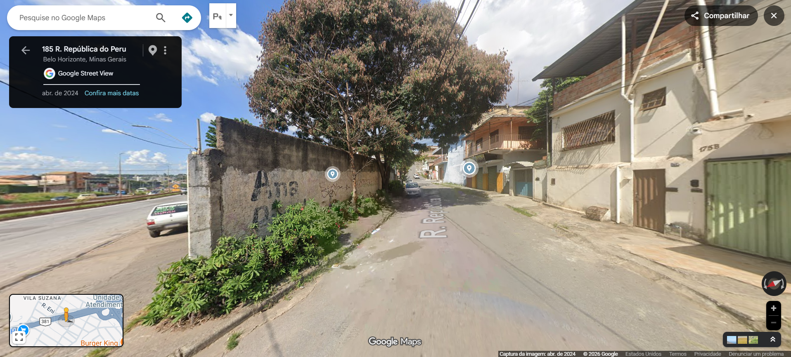
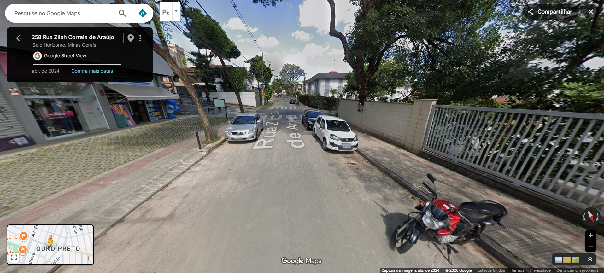
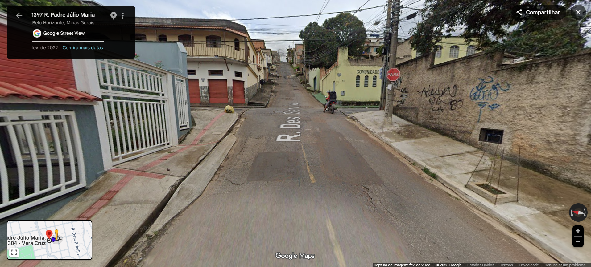
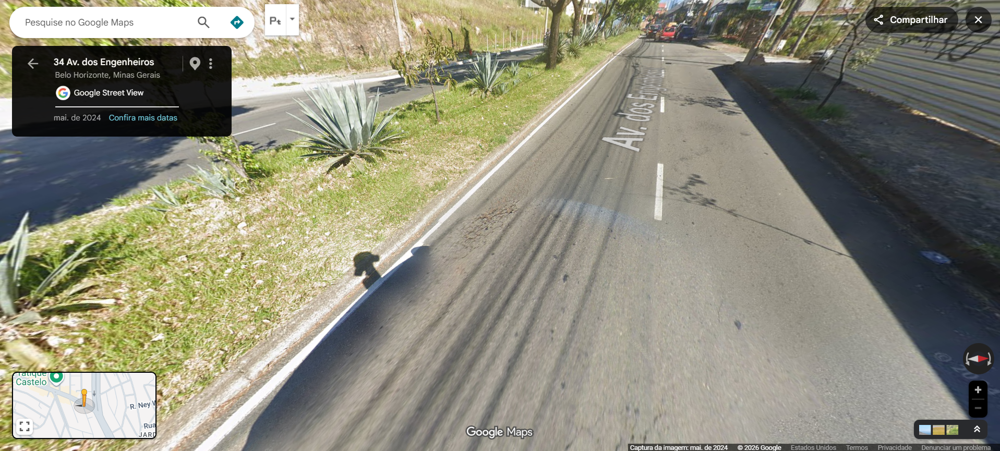
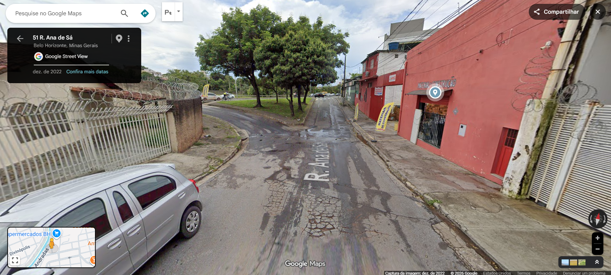
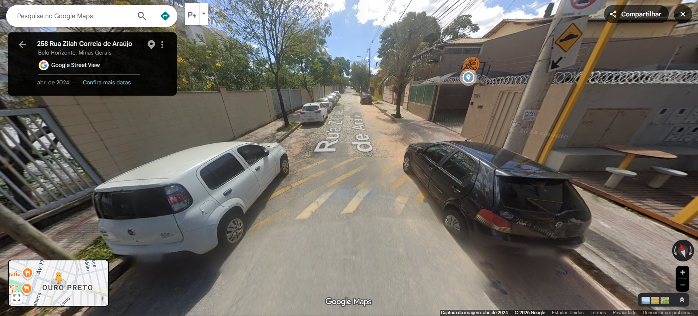
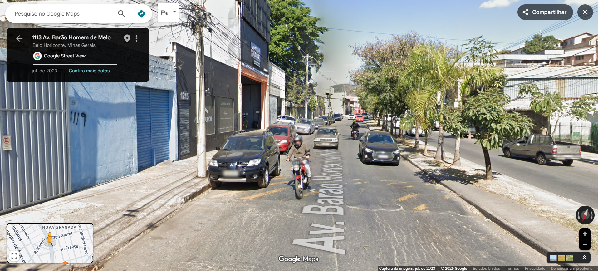

## Aim

To compare built environment characteristics collected through virtual audit and automated assessment using Gemini in a subsample of street segments from Belo Horizonte, Brazil.

## Virtual audit

The ELSI-Urbe Virtual Audit subproject was conducted using a systematic observation method between April and October 2024, based on available Google Street View images. The audit was performed at the street-segment level, considering both sides of the street, and later aggregated into census tracts, which were defined as neighborhoods. The sampling process was carried out in stages, sequentially selecting municipalities (the most populous municipality participating in ELSI-Brazil from each federative unit, with 20 available), census tracts (with ELSI-Brazil interviews), and random street segments. Data collection was conducted by a single trained rater using a multidimensional instrument and a field manual.

In the present analysis, we included only street segments from Belo Horizonte with at least five audited built environment characteristics available (n = 93 segments), namely: sidewalks, crosswalks, speed bumps, potholes, traffic lights, stop signs, sidewalk obstructions, bike lanes, trees, medians, lane markings, crossing signs, bus lanes, bus stops, and roundabouts.

## Gemini

The same street segments and image dates included in the virtual audit were automatically processed using Google Street View images and a multimodal large language model (Gemini, Google) through a fully automated pipeline. Images were downloaded for the start and end points of each segment, as well as at 25-meter intervals from the starting point. For each coordinate, eight static images covering the full 360° view were selected within a 10-meter radius. These images were then downloaded, preprocessed, and analyzed.

A prompt-based approach was used to classify built environment characteristics according to two classification schemes (binary and categorical) using several models from the Gemini family: 2.5 Flash, 2.5 Pro, 3 Flash, 3.1 Flash, 3.1 Pro, and 3.5 Flash.

In addition to the characteristics comparable to the virtual audit, the automated approach also evaluated a broader set of characteristics, including: curbs, street lights, parked vehicles, yield signs, pedestrian signals, kiosks, bollards, median barriers, traffic signs, school zones, parking lanes, and BRT stations.

However, for the present analyses, only characteristics comparable to the virtual audit were considered.

## Statistical analysis

Descriptive frequencies were calculated for each characteristic in both approaches. Agreement between the virtual audit and the automated assessment was evaluated using observed agreement (%) and Cohen’s kappa coefficient, with corresponding 95% confidence intervals.

Kappa values were not estimated for characteristics with insufficient variability (i.e., when one or both approaches classified all observations into a single category), and were therefore reported as not applicable (NA).

The automated assessment using Gemini was implemented in Python. Data management, dataset organization, and all statistical analyses were performed in R.

```{r}
#| label: Packages
#| code-summary: Packages
rm(list = ls())
library(pacman)
p_load(
  # Data manipulation and wrangling
  tidyverse,
  dplyr,
  purrr,
  here,
  # Data import
  haven,
  readxl,
  writexl,
  # Descriptive statistics
  janitor,
  gtsummary,
  # Agreement / reliability
  irr,
  psych,
  # Diagnostic performance / ROC
  pROC,
  # Tables and reporting
  gt,
  kableExtra,
  patchwork,
  # Label repulsion
  ggrepel
)
```

```{r}
#| label: Load datasets
#| code-summary: Load datasets
# Legacy datasets (binary variables)
legacy_predictions <- list(
  flash_2_5 = readRDS(here(
    "predictions",
    "streetview_predictions_dates_legacy_2.5-flash.rds"
  )),
  pro_2_5 = readRDS(here(
    "predictions",
    "streetview_predictions_dates_legacy_2.5-pro.rds"
  )),
  flash_3 = readRDS(here(
    "predictions",
    "streetview_predictions_dates_legacy_3-flash.rds"
  )),
  flash_3_1 = readRDS(here(
    "predictions",
    "streetview_predictions_dates_legacy_3.1-flash.rds"
  )),
  pro_3_1 = readRDS(here(
    "predictions",
    "streetview_predictions_dates_legacy_3.1-pro.rds"
  )),
  flash_3_5 = readRDS(here(
    "predictions",
    "streetview_predictions_dates_legacy_3.5-flash.rds"
  ))
)
# Canvas datasets (categorical variables)
canvas_predictions <- list(
  flash_2_5 = readRDS(here(
    "predictions",
    "streetview_predictions_dates_canvas_2.5-flash.rds"
  )),
  pro_2_5 = readRDS(here(
    "predictions",
    "streetview_predictions_dates_canvas_2.5-pro.rds"
  )),
  flash_3 = readRDS(here(
    "predictions",
    "streetview_predictions_dates_canvas_3-flash.rds"
  )),
  flash_3_1 = readRDS(here(
    "predictions",
    "streetview_predictions_dates_canvas_3.1-flash.rds"
  )),
  pro_3_1 = readRDS(here(
    "predictions",
    "streetview_predictions_dates_canvas_3.1-pro.rds"
  )),
  flash_3_5 = readRDS(here(
    "predictions",
    "streetview_predictions_dates_canvas_3.5-flash.rds"
  ))
)
```

## Results

Agreement between the audit and the Gemini models ranged from slight to almost perfect. Overall, Gemini 3.1 Flash showed the highest mean kappa (0.516) for binary variables, indicating the strongest agreement with the virtual audit, while Gemini 2.5 Flash achieved the same number of variable-level wins (5). Agreement was substantially lower for categorical variables, with mean kappa values ranging from 0.156 to 0.287 across models, suggesting that Gemini performed better when identifying the presence or absence of features than when classifying them into multiple categories. Kappa could not be estimated for some variables because of insufficient variability in ratings. Lower kappa values for several characteristics likely reflect chance agreement and the low prevalence of certain features.

### Legacy descriptive

```{r}
#| label: Descriptive legacy table function
#| code-summary: Descriptive legacy table function
# Define variables
vars_base <- c(
  "swalk_pres_cat",
  "str_cwalk",
  "str_scont1",
  "str_cond_cat2",
  "str_tcont3",
  "str_tcont1",
  "swalk_cont_cat2",
  "str_blane",
  "veg_tree_cat2",
  "str_med_cat2",
  "str_lanevis_cat2",
  "str_cstop_cat2",
  "trans_blane",
  "trans_stop",
  "str_tcont2"
)

# Define variable labels
var_labels <- c(
  swalk_pres_cat = "Sidewalk",
  str_cwalk = "Crosswalk",
  str_scont1 = "Speed bumps",
  str_cond_cat2 = "Poor street condition (pothole)",
  str_tcont3 = "Traffic light",
  str_tcont1 = "Stop sign",
  swalk_cont_cat2 = "Sidewalk obstruction",
  str_blane = "Bike lane",
  veg_tree_cat2 = "Trees",
  str_med_cat2 = "Median",
  str_lanevis_cat2 = "Lane markings",
  str_cstop_cat2 = "Pedestrian crossing sign",
  trans_blane = "Bus lane",
  trans_stop = "Bus stop",
  str_tcont2 = "Roundabout"
)

# Calculate prevalence
calc_prop <- function(data, var, suffix) {
  mean(data[[paste0(var, suffix)]], na.rm = TRUE)
}

# Calculate observed agreement
calc_agreement <- function(data, var) {
  x <- data[[paste0(var, "_0")]]
  y <- data[[paste0(var, "_1")]]
  mean(x == y, na.rm = TRUE)
}

# Calculate Cohen's kappa and confidence intervals
calc_kappa <- function(data, var) {
  x <- data[[paste0(var, "_0")]]
  y <- data[[paste0(var, "_1")]]
  valid <- !is.na(x) & !is.na(y)
  x <- x[valid]
  y <- y[valid]
  if (length(unique(x)) < 2 | length(unique(y)) < 2) {
    return(c(
      kappa = NA,
      lwr = NA,
      upr = NA
    ))
  }
  k <- psych::cohen.kappa(cbind(x, y))
  ci <- k$confid[1, ]
  c(
    kappa = unname(ci["estimate"]),
    lwr = unname(ci["lower"]),
    upr = unname(ci["upper"])
  )
}

# Build descriptive agreement table
build_table <- function(data) {
  purrr::map_dfr(vars_base, function(v) {
    k <- calc_kappa(data, v)
    tibble::tibble(
      variable = var_labels[v],
      audit = calc_prop(data, v, "_0"),
      gemini = calc_prop(data, v, "_1"),
      agreement = calc_agreement(data, v),
      kappa = k["kappa"],
      kappa_lwr = k["lwr"],
      kappa_upr = k["upr"]
    )
  }) %>%
    dplyr::mutate(
      audit = audit * 100,
      gemini = gemini * 100,
      agreement = agreement * 100
    )
}

# Create descriptive tables
tables <- purrr::map(
  legacy_predictions,
  build_table
)

# Model labels
model_labels <- c(
  flash_2_5 = "Gemini 2.5 Flash",
  pro_2_5 = "Gemini 2.5 Pro",
  flash_3 = "Gemini 3 Flash",
  flash_3_1 = "Gemini 3.1 Flash",
  pro_3_1 = "Gemini 3.1 Pro",
  flash_3_5 = "Gemini 3.5 Flash"
)

# Format descriptive agreement tables
format_gt_table <- function(data, title) {
  data %>%
    gt() %>%
    fmt_number(
      columns = c(audit, gemini, agreement),
      decimals = 1
    ) %>%
    fmt_number(
      columns = c(kappa, kappa_lwr, kappa_upr),
      decimals = 2
    ) %>%
    cols_label(
      variable = "Variable",
      audit = "Audit (%)",
      gemini = "Gemini (%)",
      agreement = "Observed agreement (%)",
      kappa = "Kappa",
      kappa_lwr = "Lower CI",
      kappa_upr = "Upper CI"
    ) %>%
    tab_header(
      title = title
    ) %>%
    tab_source_note(
      source_note = paste(
        "Kappa was not estimated (NA) for variables with",
        "insufficient variability (i.e., when one or both",
        "raters had only one category)."
      )
    )
}

# Create formatted tables for all legacy models
gt_tables <- purrr::imap(
  tables,
  ~ format_gt_table(
    .x,
    model_labels[.y]
  )
)
```

```{r}
#| label: Gemini 2.5 Flash legacy table
#| code-summary: Gemini 2.5 Flash legacy table
gt_tables$flash_2_5
```

```{r}
#| label: Gemini 2.5 Pro legacy table
#| code-summary: Gemini 2.5 Pro legacy table
gt_tables$pro_2_5
```

```{r}
#| label: Gemini 3 Flash legacy table
#| code-summary: Gemini 3 Flash legacy table

gt_tables$flash_3
```

```{r}
#| label: Gemini 3.1 Flash legacy table
#| code-summary: Gemini 3.1 Flash legacy table
gt_tables$flash_3_1
```

```{r}
#| label: Gemini 3.1 Pro legacy table
#| code-summary: Gemini 3.1 Pro legacy table
gt_tables$pro_3_1
```

```{r}
#| label: Gemini 3.5 Flash legacy table
#| code-summary: Gemini 3.5 Flash legacy table
gt_tables$flash_3_5
```

### Kappa comparison legacy table

```{r}
#| label: Kappa comparison legacy table
#| code-summary: Kappa comparison legacy table
# Create long kappa dataset
kappa_long_analysis <- purrr::imap_dfr(
  tables,
  function(df, model_name) {
    df %>%
      select(
        variable,
        kappa
      ) %>%
      mutate(
        model = model_name
      )
  }
)

# Create wide kappa comparison table
kappa_table <- kappa_long_analysis %>%
  select(
    variable,
    model,
    kappa
  ) %>%
  pivot_wider(
    names_from = model,
    values_from = kappa
  ) %>%
  mutate(
    mean_kappa = rowMeans(
      select(., -variable),
      na.rm = TRUE
    )
  ) %>%
  arrange(
    desc(mean_kappa)
  ) %>%
  select(
    -mean_kappa
  )

# Calculate mean kappa for each model
mean_row <- kappa_table %>%
  summarise(
    across(
      -variable,
      ~ mean(.x, na.rm = TRUE)
    )
  ) %>%
  mutate(
    variable = "Mean",
    .before = 1
  )

# Calculate wins by model
winner_vector <- apply(
  kappa_table[, -1],
  1,
  function(x) {
    x[is.na(x)] <- -Inf
    names(x)[which.max(x)]
  }
)
wins <- tibble(
  winner = winner_vector
) %>%
  count(
    winner,
    name = "wins"
  )

# Create wins row
wins_row <- tibble(
  variable = "Wins"
)
for (model_name in names(kappa_table)[-1]) {
  value <- wins %>%
    filter(
      winner == model_name
    ) %>%
    pull(wins)
  wins_row[[model_name]] <- ifelse(
    length(value) == 0,
    0,
    value
  )
}

# Append summary rows
kappa_table <- bind_rows(
  kappa_table,
  mean_row,
  wins_row
)

# Display table
kappa_table %>%
  gt() %>%
  fmt_number(
    columns = -variable,
    rows = variable != "Wins",
    decimals = 3
  ) %>%
  fmt_number(
    columns = -variable,
    rows = variable == "Wins",
    decimals = 0
  ) %>%
  tab_style(
    style = cell_text(weight = "bold"),
    locations = cells_body(
      rows = variable %in%
        c(
          "Mean",
          "Wins"
        )
    )
  ) %>%
  cols_label(
    variable = "Variable",
    flash_2_5 = "2.5 Flash",
    pro_2_5 = "2.5 Pro",
    flash_3 = "3 Flash",
    flash_3_1 = "3.1 Flash",
    pro_3_1 = "3.1 Pro",
    flash_3_5 = "3.5 Flash"
  ) %>%
  tab_header(
    title = "Legacy: Cohen's Kappa by Variable and Model"
  )
```

### Canvas descriptive

```{r}
#| label: Descriptive canvas table function
#| code-summary: Descriptive canvas table function
# Define variables
vars_canvas <- c(
  "bldg_pres",
  "bldg_type0",
  "bldg_type1",
  "bldg_cond",
  "bldg_vac",
  "bldg_bwin",
  "bldg_graf",
  "bldg_mur",
  "bldg_elec0",
  "bldg_elec1",
  "bldg_elec2",
  "bldg_elec3",
  "bldg_elec4",
  "bldg_lotes",
  "veg_tree",
  "veg_gard",
  "veg_park",
  "litter_cont",
  "litter_pres",
  "litter_type0",
  "litter_type1",
  "litter_type2",
  "litter_type3",
  "str_mat",
  "str_cond",
  "str_lanes",
  "str_dir",
  "str_lanevis",
  "str_med",
  "str_tcont0",
  "str_tcont1",
  "str_tcont2",
  "str_tcont3",
  "str_scont0",
  "str_scont1",
  "str_scont2",
  "str_scont3",
  "str_cwalk",
  "str_cstop",
  "str_intyp",
  "str_blane",
  "swalk_pres",
  "swalk_sep",
  "swalk_mat",
  "swalk_ext",
  "swalk_uneven",
  "swalk_cont",
  "swalk_why0",
  "swalk_why1",
  "swalk_why2",
  "swalk_why3",
  "trans_blane",
  "trans_bsep",
  "trans_train",
  "trans_tsafe",
  "trans_stop"
)

# Variable labels
# Replace with descriptive labels if desired
var_labels <- setNames(vars_canvas, vars_canvas)

# Build descriptive table
build_table_multiclass <- function(data, variables) {
  purrr::map_dfr(variables, function(v) {
    x <- data[[paste0(v, "_0")]]
    y <- data[[paste0(v, "_1")]]
    categories <- sort(unique(c(x, y)))
    categories <- categories[!is.na(categories)]
    agreement <- mean(x == y, na.rm = TRUE) * 100
    valid <- !is.na(x) & !is.na(y)
    x_valid <- x[valid]
    y_valid <- y[valid]
    if (
      length(unique(x_valid)) < 2 ||
        length(unique(y_valid)) < 2
    ) {
      kappa <- NA
      lwr <- NA
      upr <- NA
    } else {
      k <- suppressWarnings(
        psych::cohen.kappa(cbind(x_valid, y_valid))
      )
      ci <- k$confid[1, ]
      kappa <- unname(ci["estimate"])
      lwr <- unname(ci["lower"])
      upr <- unname(ci["upper"])
    }

    # Variable row
    variable_row <- tibble::tibble(
      row_type = "variable",
      variable = var_labels[v],
      audit = NA_real_,
      gemini = NA_real_,
      agreement = agreement,
      kappa = kappa,
      kappa_lwr = lwr,
      kappa_upr = upr
    )

    # Category rows
    category_rows <- purrr::map_dfr(categories, function(cat) {
      tibble::tibble(
        row_type = "category",
        variable = paste0("   ", cat),
        audit = mean(x == cat, na.rm = TRUE) * 100,
        gemini = mean(y == cat, na.rm = TRUE) * 100,
        agreement = NA_real_,
        kappa = NA_real_,
        kappa_lwr = NA_real_,
        kappa_upr = NA_real_
      )
    })
    dplyr::bind_rows(
      variable_row,
      category_rows
    )
  })
}

# Create descriptive tables
tables_canvas <- purrr::map(
  canvas_predictions,
  ~ build_table_multiclass(
    data = .x,
    variables = vars_canvas
  )
)

# Model labels
model_labels <- c(
  flash_2_5 = "Gemini 2.5 Flash",
  pro_2_5 = "Gemini 2.5 Pro",
  flash_3 = "Gemini 3 Flash",
  flash_3_1 = "Gemini 3.1 Flash",
  pro_3_1 = "Gemini 3.1 Pro",
  flash_3_5 = "Gemini 3.5 Flash"
)

# Format GT table
format_gt_table <- function(data, title) {
  data_display <- data %>%
    mutate(
      audit_chr = case_when(
        row_type == "variable" ~ "",
        TRUE ~ sprintf("%.1f", audit)
      ),
      gemini_chr = case_when(
        row_type == "variable" ~ "",
        TRUE ~ sprintf("%.1f", gemini)
      ),
      agreement_chr = case_when(
        row_type == "category" ~ "",
        is.na(agreement) ~ "NA",
        TRUE ~ sprintf("%.1f", agreement)
      ),
      kappa_chr = case_when(
        row_type == "category" ~ "",
        is.na(kappa) ~ "NA",
        TRUE ~ sprintf("%.2f", kappa)
      ),
      kappa_lwr_chr = case_when(
        row_type == "category" ~ "",
        is.na(kappa_lwr) ~ "NA",
        TRUE ~ sprintf("%.2f", kappa_lwr)
      ),
      kappa_upr_chr = case_when(
        row_type == "category" ~ "",
        is.na(kappa_upr) ~ "NA",
        TRUE ~ sprintf("%.2f", kappa_upr)
      )
    )
  data_display %>%
    select(
      variable,
      audit_chr,
      gemini_chr,
      agreement_chr,
      kappa_chr,
      kappa_lwr_chr,
      kappa_upr_chr
    ) %>%
    gt() %>%
    cols_label(
      variable = "Variable",
      audit_chr = "Audit (%)",
      gemini_chr = "Gemini (%)",
      agreement_chr = "Observed agreement (%)",
      kappa_chr = "Kappa",
      kappa_lwr_chr = "Lower CI",
      kappa_upr_chr = "Upper CI"
    ) %>%
    cols_align(
      align = "right",
      columns = everything()
    ) %>%
    tab_header(
      title = title
    ) %>%
    tab_source_note(
      source_note = paste(
        "Kappa was not estimated (NA) for variables with",
        "insufficient variability (i.e., when one or both",
        "raters had only one category)."
      )
    )
}

# Create formatted tables
gt_tables_canvas <- purrr::imap(
  tables_canvas,
  ~ format_gt_table(
    .x,
    model_labels[.y]
  )
)
```

```{r}
#| label: Gemini 2.5 Flash canvas table
#| code-summary: Gemini 2.5 Flash canvas table
#gt_tables_canvas$flash_2_5
```

```{r}
#| label: Gemini 2.5 Pro canvas table
#| code-summary: Gemini 2.5 Pro canvas table
#gt_tables_canvas$pro_2_5
```

```{r}
#| label: Gemini 3 Flash canvas table
#| code-summary: Gemini 3 Flash canvas table
#gt_tables_canvas$flash_3
```

```{r}
#| label: Gemini 3.1 Flash canvas table
#| code-summary: Gemini 3.1 Flash canvas table
#gt_tables_canvas$flash_3_1
```

```{r}
#| label: Gemini 3.1 Pro canvas table
#| code-summary: Gemini 3.1 Pro canvas table
#gt_tables_canvas$pro_3_1
```

```{r}
#| label: Gemini 3.5 Flash canvas table
#| code-summary: Gemini 3.5 Flash canvas table
#gt_tables_canvas$flash_3_5
```

### Kappa comparison canvas table

```{r}
#| label: Kappa comparison canvas table
#| code-summary: Kappa comparison canvas table
# Create long kappa dataset
kappa_long_analysis_canvas <- purrr::imap_dfr(
  tables_canvas,
  function(df, model_name) {
    df %>%
      filter(
        row_type == "variable"
      ) %>%
      select(
        variable,
        kappa
      ) %>%
      mutate(
        model = model_name
      )
  }
)

# Create wide kappa comparison table
kappa_table_canvas <- kappa_long_analysis_canvas %>%
  select(
    variable,
    model,
    kappa
  ) %>%
  pivot_wider(
    names_from = model,
    values_from = kappa
  ) %>%
  mutate(
    mean_kappa = rowMeans(
      select(., -variable),
      na.rm = TRUE
    )
  ) %>%
  arrange(
    desc(mean_kappa)
  ) %>%
  select(
    -mean_kappa
  )

# Calculate mean kappa for each model
mean_row <- kappa_table_canvas %>%
  summarise(
    across(
      -variable,
      ~ mean(.x, na.rm = TRUE)
    )
  ) %>%
  mutate(
    variable = "Mean",
    .before = 1
  )

# Calculate wins by model
winner_vector <- apply(
  kappa_table_canvas[, -1],
  1,
  function(x) {
    x[is.na(x)] <- -Inf
    names(x)[which.max(x)]
  }
)
wins <- tibble(
  winner = winner_vector
) %>%
  count(
    winner,
    name = "wins"
  )

# Create wins row
wins_row <- tibble(
  variable = "Wins"
)
for (model_name in names(kappa_table_canvas)[-1]) {
  value <- wins %>%
    filter(
      winner == model_name
    ) %>%
    pull(wins)
  wins_row[[model_name]] <- ifelse(
    length(value) == 0,
    0,
    value
  )
}

# Append summary rows
kappa_table_canvas <- bind_rows(
  kappa_table_canvas,
  mean_row,
  wins_row
)

# Display table
kappa_table_canvas %>%
  gt() %>%
  fmt_number(
    columns = -variable,
    rows = variable != "Wins",
    decimals = 3
  ) %>%
  fmt_number(
    columns = -variable,
    rows = variable == "Wins",
    decimals = 0
  ) %>%
  tab_style(
    style = cell_text(weight = "bold"),
    locations = cells_body(
      rows = variable %in%
        c(
          "Mean",
          "Wins"
        )
    )
  ) %>%
  cols_label(
    variable = "Variable",
    flash_2_5 = "2.5 Flash",
    pro_2_5 = "2.5 Pro",
    flash_3 = "3 Flash",
    flash_3_1 = "3.1 Flash",
    pro_3_1 = "3.1 Pro",
    flash_3_5 = "3.5 Flash"
  ) %>%
  tab_header(
    title = "Canvas: Cohen's Kappa by Variable and Model"
  )
```

### Diagnostic performance

Sensitivity (the ability to correctly identify the presence of a feature), specificity (the ability to correctly identify its absence), positive predictive value (PPV; the probability that a detected feature is truly present), negative predictive value (NPV; the probability that a feature classified as absent is truly absent), and F1-score (a summary measure combining sensitivity and PPV) were generally high across models. Performance was strongest for visually distinctive features such as sidewalks, trees, traffic lights, bus stops, and roundabouts, and lower for characteristics that were less common or more difficult to identify, including speed bumps, lane markings, stop signs, and sidewalk obstructions. Overall, these metrics were consistent with the kappa results, indicating better performance for clearly visible built-environment features and only modest differences between Gemini models.

```{r}
#| label: Diagnostic performance data preparation
#| code-summary: Diagnostic performance data preparation
# Define variables
vars_base <- c(
  "swalk_pres_cat",
  "str_cwalk",
  "str_scont1",
  "str_cond_cat2",
  "str_tcont3",
  "str_tcont1",
  "swalk_cont_cat2",
  "str_blane",
  "veg_tree_cat2",
  "str_med_cat2",
  "str_lanevis_cat2",
  "str_cstop_cat2",
  "trans_blane",
  "trans_stop",
  "str_tcont2"
)

# Define variable labels
var_labels <- c(
  swalk_pres_cat = "Sidewalk",
  str_cwalk = "Crosswalk",
  str_scont1 = "Speed bumps",
  str_cond_cat2 = "Poor street condition (pothole)",
  str_tcont3 = "Traffic light",
  str_tcont1 = "Stop sign",
  swalk_cont_cat2 = "Sidewalk obstruction",
  str_blane = "Bike lane",
  veg_tree_cat2 = "Trees",
  str_med_cat2 = "Median",
  str_lanevis_cat2 = "Lane markings",
  str_cstop_cat2 = "Pedestrian crossing sign",
  trans_blane = "Bus lane",
  trans_stop = "Bus stop",
  str_tcont2 = "Roundabout"
)

# Calculate diagnostic performance metrics
calc_metrics <- function(data, var) {
  ref <- data[[paste0(var, "_0")]]
  test <- data[[paste0(var, "_1")]]
  valid <- !is.na(ref) & !is.na(test)
  ref <- ref[valid]
  test <- test[valid]
  TP <- sum(ref == 1 & test == 1)
  TN <- sum(ref == 0 & test == 0)
  FP <- sum(ref == 0 & test == 1)
  FN <- sum(ref == 1 & test == 0)
  tibble(
    variable = as.character(var_labels[var]),
    sensitivity = ifelse(
      (TP + FN) == 0,
      NA,
      TP / (TP + FN)
    ),
    specificity = ifelse(
      (TN + FP) == 0,
      NA,
      TN / (TN + FP)
    ),
    ppv = ifelse(
      (TP + FP) == 0,
      NA,
      TP / (TP + FP)
    ),
    npv = ifelse(
      (TN + FN) == 0,
      NA,
      TN / (TN + FN)
    ),
    f1_score = ifelse(
      (2 * TP + FP + FN) == 0,
      NA,
      2 * TP / (2 * TP + FP + FN)
    )
  )
}

# Calculate diagnostic performance metrics for all legacy models
metrics_long <- purrr::imap_dfr(
  legacy_predictions,
  function(data, model_name) {
    purrr::map_dfr(
      vars_base,
      ~ calc_metrics(data, .x)
    ) %>%
      mutate(
        model = recode(
          model_name,
          flash_2_5 = "Gemini 2.5 Flash",
          pro_2_5 = "Gemini 2.5 Pro",
          flash_3 = "Gemini 3 Flash",
          flash_3_1 = "Gemini 3.1 Flash",
          pro_3_1 = "Gemini 3.1 Pro",
          flash_3_5 = "Gemini 3.5 Flash"
        )
      )
  }
) %>%
  pivot_longer(
    cols = c(
      sensitivity,
      specificity,
      ppv,
      npv,
      f1_score
    ),
    names_to = "metric",
    values_to = "value"
  )

# Create diagnostic performance plotting function
plot_metric <- function(metric_name, title_text) {
  ggplot(
    filter(
      metrics_long,
      metric == metric_name
    ),
    aes(
      x = variable,
      y = value,
      fill = model
    )
  ) +
    geom_col(
      position = position_dodge(width = 0.8),
      width = 0.7
    ) +
    scale_fill_manual(
      values = c(
        "Gemini 2.5 Flash" = "#1B9E77",
        "Gemini 2.5 Pro" = "#D95F02",
        "Gemini 3 Flash" = "#7570B3",
        "Gemini 3.1 Flash" = "#E7298A",
        "Gemini 3.1 Pro" = "#377EB8",
        "Gemini 3.5 Flash" = "#E6AB02"
      )
    ) +
    scale_y_continuous(
      limits = c(0, 1),
      breaks = seq(
        0,
        1,
        0.2
      )
    ) +
    labs(
      title = title_text,
      x = NULL,
      y = "Value\n",
      fill = NULL
    ) +
    theme_minimal(
      base_size = 14
    ) +
    theme(
      panel.grid.minor = element_blank(),
      legend.position = "bottom",
      axis.text.x = element_text(
        angle = 45,
        hjust = 1,
        vjust = 1
      )
    )
}
```

```{r}
#| label: Sensitivity plot
#| code-summary: Sensitivity plot
#| fig-width: 16
#| fig-height: 8
plot_metric(
  "sensitivity",
  "Sensitivity"
)
```

```{r}
#| label: Specificity plot
#| code-summary: Specificity plot
#| fig-width: 16
#| fig-height: 8
plot_metric(
  "specificity",
  "Specificity"
)
```

```{r}
#| label: PPV plot
#| code-summary: PPV plot
#| fig-width: 16
#| fig-height: 8
plot_metric(
  "ppv",
  "Positive Predictive Value (PPV)"
)
```

```{r}
#| label: NPV plot
#| code-summary: NPV plot
#| fig-width: 16
#| fig-height: 8
plot_metric(
  "npv",
  "Negative Predictive Value (NPV)"
)
```

```{r}
#| label: F1-score plot
#| code-summary: F1-score plot
#| fig-width: 16
#| fig-height: 8
plot_metric(
  "f1_score",
  "F1-score"
)
```

### ROC

Receiver operating characteristic (ROC) analyses, which evaluate a model’s ability to distinguish between the presence and absence of a characteristic, were consistent with the agreement and diagnostic performance metrics. Performance was highest for roundabouts, traffic lights, bus stops, medians, and pedestrian crossing signs, and lower for speed bumps, stop signs, and sidewalk obstructions. Differences between Gemini models were generally modest.

```{r}
#| label: ROC panel
#| code-summary: ROC panel
#| fig-width: 12
#| fig-height: 12
# Define variables
vars_base <- c(
  "swalk_pres_cat",
  "str_cwalk",
  "str_scont1",
  "str_cond_cat2",
  "str_tcont3",
  "str_tcont1",
  "swalk_cont_cat2",
  "str_blane",
  "veg_tree_cat2",
  "str_med_cat2",
  "str_lanevis_cat2",
  "str_cstop_cat2",
  "trans_blane",
  "trans_stop",
  "str_tcont2"
)

# Define variable labels
var_labels <- c(
  swalk_pres_cat = "Sidewalk",
  str_cwalk = "Crosswalk",
  str_scont1 = "Speed bumps",
  str_cond_cat2 = "Poor street condition (pothole)",
  str_tcont3 = "Traffic light",
  str_tcont1 = "Stop sign",
  swalk_cont_cat2 = "Sidewalk obstruction",
  str_blane = "Bike lane",
  veg_tree_cat2 = "Trees",
  str_med_cat2 = "Median",
  str_lanevis_cat2 = "Lane markings",
  str_cstop_cat2 = "Pedestrian crossing sign",
  trans_blane = "Bus lane",
  trans_stop = "Bus stop",
  str_tcont2 = "Roundabout"
)

# Calculate ROC curve data
calc_roc_data <- function(data, var, model_name) {
  ref <- data[[paste0(var, "_0")]]
  pred <- data[[paste0(var, "_1")]]
  valid <- !is.na(ref) & !is.na(pred)
  ref <- ref[valid]
  pred <- pred[valid]
  if (length(unique(ref)) < 2) {
    return(NULL)
  }
  roc_obj <- pROC::roc(
    ref,
    pred,
    quiet = TRUE
  )
  tibble(
    specificity = roc_obj$specificities,
    sensitivity = roc_obj$sensitivities
  ) %>%
    mutate(
      fpr = 1 - specificity,
      variable = as.character(var_labels[var]),
      auc = as.numeric(
        pROC::auc(roc_obj)
      ),
      model = model_name
    )
}

# Calculate ROC curves for all legacy models
roc_panel <- purrr::imap_dfr(
  legacy_predictions,
  function(data, model_name) {
    model_label <- recode(
      model_name,
      flash_2_5 = "Gemini 2.5 Flash",
      pro_2_5 = "Gemini 2.5 Pro",
      flash_3 = "Gemini 3 Flash",
      flash_3_1 = "Gemini 3.1 Flash",
      pro_3_1 = "Gemini 3.1 Pro",
      flash_3_5 = "Gemini 3.5 Flash"
    )
    purrr::map_dfr(
      vars_base,
      ~ calc_roc_data(
        data,
        .x,
        model_label
      )
    )
  }
)

# Create ROC panel plot
ggplot(
  roc_panel,
  aes(
    x = fpr,
    y = sensitivity,
    color = model
  )
) +
  geom_line(
    linewidth = 1
  ) +
  geom_abline(
    slope = 1,
    intercept = 0,
    linetype = 2,
    color = "gray60"
  ) +
  facet_wrap(
    ~variable,
    ncol = 4
  ) +
  coord_equal() +
  scale_color_manual(
    values = c(
      "Gemini 2.5 Flash" = "#1B9E77",
      "Gemini 2.5 Pro" = "#D95F02",
      "Gemini 3 Flash" = "#7570B3",
      "Gemini 3.1 Flash" = "#E7298A",
      "Gemini 3.1 Pro" = "#08519C",
      "Gemini 3.5 Flash" = "#E6AB02"
    )
  ) +
  scale_x_continuous(
    limits = c(0, 1),
    breaks = seq(
      0,
      1,
      0.5
    )
  ) +
  scale_y_continuous(
    limits = c(0, 1),
    breaks = seq(
      0,
      1,
      0.5
    )
  ) +
  labs(
    x = "\nFalse Positive Rate",
    y = "True Positive Rate\n",
    color = NULL
  ) +
  theme_minimal(
    base_size = 14
  ) +
  theme(
    panel.grid.minor = element_blank(),
    legend.position = "bottom"
  )
```

### Final results

Overall, performance was comparable across Gemini models, although Gemini 3.1 Flash generally showed the strongest agreement with the virtual audit. All models performed best for larger and visually distinctive features, such as traffic lights, bus stops, medians, trees, and roundabouts, whereas performance was weaker for speed bumps, stop signs, lane markings, and sidewalk obstructions. Agreement was substantially higher for binary than for categorical variables, suggesting that the models were better at identifying the presence or absence of features than classifying them into multiple categories.

## Within-segment variability analysis

Within-segment consistency was highest for bus lanes, roundabouts, bike lanes, speed bumps, and traffic lights, whereas potholes, lane markings, sidewalks, and sidewalk obstructions showed greater variability across points. These results suggest that some built-environment features are consistently identified along street segments, while others depend more on the specific location captured in Street View imagery.

```{r}
#| label: Within-segment variability analysis
#| code-summary: Within-segment variability analysis
# Load Gemini 3.1 Flash point-level predictions
df_points <- read_csv(
  here(
    "predictions",
    "streetview_predictions_dates_legacy_3.1-flash.csv"
  ),
  show_col_types = FALSE
)

# Standardize column names
names(df_points) <- tolower(names(df_points))

# Keep valid observations and create segment identifier
df_points <- df_points %>%
  filter(
    status == "ok"
  ) %>%
  mutate(
    identificador = sub(
      "_p.*$",
      "",
      id
    )
  )

# Variables of interest
vars <- c(
  "sidewalks",
  "crosswalks",
  "speed_bumps",
  "pothole",
  "traffic_light",
  "stop_sign",
  "sidewalk_obstruction",
  "bike_lane",
  "trees",
  "median",
  "lane_markings",
  "crossing_sign",
  "bus_lane",
  "bus_stop",
  "roundabout"
)

# Variable labels
var_labels <- c(
  sidewalks = "Sidewalk",
  crosswalks = "Crosswalk",
  speed_bumps = "Speed bump",
  pothole = "Poor street condition (pothole)",
  traffic_light = "Traffic light",
  stop_sign = "Stop sign",
  sidewalk_obstruction = "Sidewalk obstruction",
  bike_lane = "Bike lane",
  trees = "Trees",
  median = "Median",
  lane_markings = "Lane markings",
  crossing_sign = "Pedestrian crossing sign",
  bus_lane = "Bus lane",
  bus_stop = "Bus stop",
  roundabout = "Roundabout"
)

# Classify each segment as always absent, always present, or mixed
segment_patterns <- df_points %>%
  group_by(identificador) %>%
  summarise(
    across(
      all_of(vars),
      ~ {
        x <- .x[!is.na(.x)]

        case_when(
          length(x) == 0 ~ NA_character_,
          all(x == 0) ~ "Always absent",
          all(x == 1) ~ "Always present",
          TRUE ~ "Mixed"
        )
      },
      .names = "{.col}"
    ),
    .groups = "drop"
  )

# Create summary table
consistency_table <- bind_rows(
  lapply(vars, function(v) {

    tab <- segment_patterns %>%
      count(.data[[v]]) %>%
      complete(
        !!sym(v) := c(
          "Always absent",
          "Always present",
          "Mixed"
        ),
        fill = list(n = 0)
      )
    total_segments <- sum(tab$n)
    always_absent <-
      100 * tab$n[tab[[v]] == "Always absent"] / total_segments
    always_present <-
      100 * tab$n[tab[[v]] == "Always present"] / total_segments
    mixed <-
      100 * tab$n[tab[[v]] == "Mixed"] / total_segments
    tibble(
      Variable = var_labels[[v]],
      `Always absent (%)` = always_absent,
      `Always present (%)` = always_present,
      `Consistent (%)` = always_absent + always_present,
      `Mixed (%)` = mixed
    )
  })
) %>%
  arrange(
    desc(`Mixed (%)`)
  )

# Display table
consistency_table %>%
  gt() %>%
  cols_label(
    Variable = "Variable",
    `Always absent (%)` = "Always absent (%)",
    `Always present (%)` = "Always present (%)",
    `Consistent (%)` = "Consistent (%)",
    `Mixed (%)` = "Mixed (%)"
  ) %>%
  fmt_number(
    columns = c(
      `Always absent (%)`,
      `Always present (%)`,
      `Consistent (%)`,
      `Mixed (%)`
    ),
    decimals = 1
  ) %>%
  tab_header(
    title = md(
      "**Within-Segment Classification Patterns of Gemini 3.1 Flash**"
    ),
    subtitle = md(
      "Percentage of segments with identical or varying classifications across points"
    )
  ) %>%
  cols_align(
    align = "center",
    columns = c(
      `Always absent (%)`,
      `Always present (%)`,
      `Consistent (%)`,
      `Mixed (%)`
    )
  ) %>%
  cols_width(
    Variable ~ px(300)
  )
```

## Discrepancy analysis

In this step, discrepancies between human and AI assessments are examined for features selected due to their intermediate and lower performance in agreement and diagnostic metrics. For each variable, segments with disagreement are identified, the type of discrepancy is classified (human = 1 and AI = 0; or human = 0 and AI = 1), and these cases are linked to geographic coordinates and Google Street View links, enabling visual inspection and interpretation of the differences.

```{r}
#| label: Extract identifiers and create Street View tables with discrepancies
#| code-summary: Extract identifiers and create Street View tables with discrepancies
# Select Gemini 3.1 Flash dataset
df_model <- legacy_predictions$flash_3_1 %>%
  mutate(
    identificador = as.character(identificador)
  )

# Function to identify disagreement cases
get_ids_discrepancy <- function(data, base_var) {
  var0 <- paste0(base_var, "_0") # Human audit
  var1 <- paste0(base_var, "_1") # Gemini prediction
  data %>%
    dplyr::filter(
      !is.na(.data[[var0]]),
      !is.na(.data[[var1]]),
      .data[[var0]] != .data[[var1]]
    ) %>%
    dplyr::mutate(
      discrepancy_type = dplyr::case_when(
        .data[[var0]] == 1 &
          .data[[var1]] == 0 ~ "human_1_ai_0",
        .data[[var0]] == 0 &
          .data[[var1]] == 1 ~ "human_0_ai_1"
      )
    ) %>%
    dplyr::select(
      identificador,
      discrepancy_type
    ) %>%
    distinct()
}

# Variables selected for qualitative review
vars_to_use <- c(
  "swalk_cont_cat2",
  "str_lanevis_cat2",
  "str_cond_cat2",
  "str_scont1",
  "str_tcont1",
  "str_cwalk"
)

# Labels for review tables
var_labels_review <- c(
  swalk_cont_cat2 = "Sidewalk obstruction",
  str_lanevis_cat2 = "Lane markings",
  str_cond_cat2 = "Poor street condition (pothole)",
  str_scont1 = "Speed bumps",
  str_tcont1 = "Stop sign",
  str_cwalk = "Crosswalk"
)

# Extract discrepant identifiers
ids_list <- lapply(
  vars_to_use,
  function(v) {
    get_ids_discrepancy(
      df_model,
      v
    )
  }
)
names(ids_list) <- var_labels_review[vars_to_use]

# Load coordinates
coords <- read_excel(
  "virtual_audit/items_coordinates_belo_horizonte 5more.xlsx"
) %>%
  mutate(
    identificador = as.character(id),
    lat = as.numeric(lat),
    lon = as.numeric(lon)
  )

# Create Street View review tables
views <- list()
for (var_name in names(ids_list)) {
  df_view <- coords %>%
    inner_join(
      ids_list[[var_name]],
      by = "identificador"
    ) %>%
    mutate(
      lat_lon = paste0(
        lat,
        ", ",
        lon
      ),
      streetview_url = paste0(
        "https://www.google.com/maps/@?api=1&map_action=pano&viewpoint=",
        lat,
        ",",
        lon
      )
    ) %>%
    select(
      identificador,
      discrepancy_type,
      lat_lon,
      streetview_url
    ) %>%
    arrange(
      discrepancy_type,
      as.numeric(identificador)
    )
  views[[var_name]] <- df_view
}
```

### Sidewalk obstructions 

Items marked as present by the AI but absent by human raters are likely due to obstructions that still allow pedestrian passage along the sidewalk. Conversely, cases marked as absent by the AI but present by human raters were often due to obstructions caused by trees or vegetation.

```{r}
#| echo: false
#| results: asis
cat(
  '[](https://www.google.com/maps/@?api=1&map_action=pano&viewpoint=-19.9353500964683,-43.9310052796472)<br>
  <span>human_0_ai_1</span><br><br>'
)

cat(
  '[](https://www.google.com/maps/@?api=1&map_action=pano&viewpoint=-19.8674806605816,-43.9333105108766)<br>
  <span>human_1_ai_0</span><br><br>'
)
```

### Lane markings 

Are items marked as present by the AI but absent by human raters due to crosswalk markings or differences in pavement color? Conversely, cases marked as absent by the AI but present by human raters were likely due to the markings being clearly visible in the images.

```{r}
#| echo: false
#| results: asis
cat(
  '[](https://www.google.com/maps/@?api=1&map_action=pano&viewpoint=-19.8704599360962,-43.9841267008323)<br>
  <span>human_0_ai_1</span><br><br>'
)

cat(
  '[](https://www.google.com/maps/@?api=1&map_action=pano&viewpoint=-19.9153131,-43.8919484)<br>
  <span>human_1_ai_0</span><br><br>'
)
```

### Poor street condition (potholes)

We assessed “What is the apparent condition of the roadway?” and, for this analysis, categorized it as 1 (“Bad,” “Poor,” and “Fair”) and 0 (“Good” and “Very good”). This classification approach may influence discrepancies in responses. In addition, perceptions of roadway quality based on lived experience may differ from how the AI identifies potholes.

```{r}
#| echo: false
#| results: asis
cat(
  '[](https://www.google.com/maps/@?api=1&map_action=pano&viewpoint=-19.893311404363,-43.9940116495973)<br>
  <span>human_0_ai_1</span><br><br>'
)

cat(
  '[](https://www.google.com/maps/@?api=1&map_action=pano&viewpoint=-19.9151113,-43.908211)<br>
  <span>human_1_ai_0</span><br><br>'
)
```

### Speed bumps

The discrepancies observed were only cases in which the human rater identified the feature while the AI did not, likely due to differences in speed bump structures in Brazil.

```{r}
#| echo: false
#| results: asis
cat(
  '[](https://www.google.com/maps/@?api=1&map_action=pano&viewpoint=-19.8704599360962,-43.9841267008323)<br>
  <span>human_1_ai_0</span><br><br>'
)

cat(
  '[](https://www.google.com/maps/@?api=1&map_action=pano&viewpoint=-19.9439631009899,-43.9697897363183)<br>
  <span>human_1_ai_0</span><br><br>'
)
```

### Stop signs

“CANVAS Instructions: Indicate the presence of a device to direct or control traffic with regard to the intersection closest to the green marker. The traffic control device may be located outside the segment as long as it controls the green marker intersection—for example, a stop sign that controls entry into a one-way segment may be on the opposite side of the intersection as the segment but would still be indicated by this item.”

The observed discrepancies are likely due to differences in how the measure was applied, as we considered the stop sign only at the starting point of the segment.

### Crosswalks

“CANVAS Instructions: Indicate the presence of a crosswalk in the segment. Consider only crosswalks that are at the intersection closest to the green marker or in the midblock.”

The observed discrepancies are likely due to differences in how the measure was applied, as we considered the crosswalk only at the starting point of the segment.

## Review spreadsheet

The spreadsheet was created to support the qualitative review of street segments containing at least two traffic-control features among crosswalks, speed bumps, traffic lights, stop signs, and pedestrian crossing signs. Each row represents a street segment identified by `identificador`, together with the corresponding Street View image date (`data_imagens_1`) and the first and last coordinates of the segment (`first_coordinate` and `last_coordinate`), which facilitate manual inspection in Google Street View. The columns `audit_n` and `gemini_n` indicate the number of selected features identified by the field audit and by Gemini 3.1 Flash, respectively. The `source` column classifies segments according to whether at least two selected features were identified by both methods (`Both`), only by the audit (`Audit only`), or only by Gemini (`Gemini only`). For each traffic-control feature, separate columns report the audit classification (`*_audit`) and the Gemini classification (`*_gemini`), where a value of 1 indicates the presence of the feature and 0 indicates its absence. This structure enables direct comparison between human and AI classifications and facilitates the identification of agreement, false positives, and false negatives during the qualitative assessment.

```{r}
#| label: Create review spreadsheet
#| code-summary: Create spreadsheet with segments containing at least two selected traffic features
# Select Gemini 3.1 Flash dataset
df_model <- legacy_predictions$flash_3_1 %>%
  mutate(
    identificador = as.character(identificador)
  )
# Variables of interest
vars_review <- c(
  "str_cwalk",
  "str_scont1",
  "str_tcont3",
  "str_tcont1",
  "str_cstop_cat2"
)
# Create review dataset
review_segments <- df_model %>%
  mutate(
    # Number of selected features present in audit
    audit_n = rowSums(
      across(
        all_of(paste0(vars_review, "_0"))
      ) ==
        1,
      na.rm = TRUE
    ),
    # Number of selected features present in Gemini
    gemini_n = rowSums(
      across(
        all_of(paste0(vars_review, "_1"))
      ) ==
        1,
      na.rm = TRUE
    ),
    # At least two selected features present
    audit_present = audit_n >= 2,
    gemini_present = gemini_n >= 2,
    # Segment classification
    source = case_when(
      audit_present & gemini_present ~ "Both",
      audit_present & !gemini_present ~ "Audit only",
      !audit_present & gemini_present ~ "Gemini only",
      TRUE ~ NA_character_
    )
  ) %>%
  filter(
    !is.na(source)
  ) %>%
  select(
    identificador,
    data_imagens_1,
    source,
    audit_n,
    gemini_n,
    str_cwalk_0,
    str_cwalk_1,
    str_scont1_0,
    str_scont1_1,
    str_tcont3_0,
    str_tcont3_1,
    str_tcont1_0,
    str_tcont1_1,
    str_cstop_cat2_0,
    str_cstop_cat2_1
  )
# Load first and last coordinates of each segment
coords <- read_excel(
  "virtual_audit/items_coordinates_belo_horizonte 5more.xlsx"
) %>%
  rename(
    identificador = id
  ) %>%
  mutate(
    identificador = as.character(identificador),
    lat = as.numeric(lat),
    lon = as.numeric(lon)
  ) %>%
  arrange(
    identificador,
    points
  ) %>%
  group_by(identificador) %>%
  summarise(
    first_coordinate = paste0(
      first(lat),
      ", ",
      first(lon)
    ),
    last_coordinate = paste0(
      last(lat),
      ", ",
      last(lon)
    ),
    .groups = "drop"
  )
# Add coordinates
review_segments <- review_segments %>%
  left_join(
    coords,
    by = "identificador"
  ) %>%
  relocate(
    first_coordinate,
    last_coordinate,
    .after = source
  )
# Rename variables for readability
review_segments <- review_segments %>%
  rename(
    crosswalk_audit = str_cwalk_0,
    crosswalk_gemini = str_cwalk_1,
    speed_bump_audit = str_scont1_0,
    speed_bump_gemini = str_scont1_1,
    traffic_light_audit = str_tcont3_0,
    traffic_light_gemini = str_tcont3_1,
    stop_sign_audit = str_tcont1_0,
    stop_sign_gemini = str_tcont1_1,
    crossing_sign_audit = str_cstop_cat2_0,
    crossing_sign_gemini = str_cstop_cat2_1
  ) %>%
  arrange(
    desc(audit_n + gemini_n),
    source,
    identificador
  )
# Save spreadsheet
writexl::write_xlsx(
  review_segments,
  "review_segments_at_least_two_traffic_features.xlsx"
)
# Summary
review_segments %>%
  count(source)
# Check number of segments
review_segments %>%
  summarise(
    n_segments = n_distinct(identificador)
  )
```